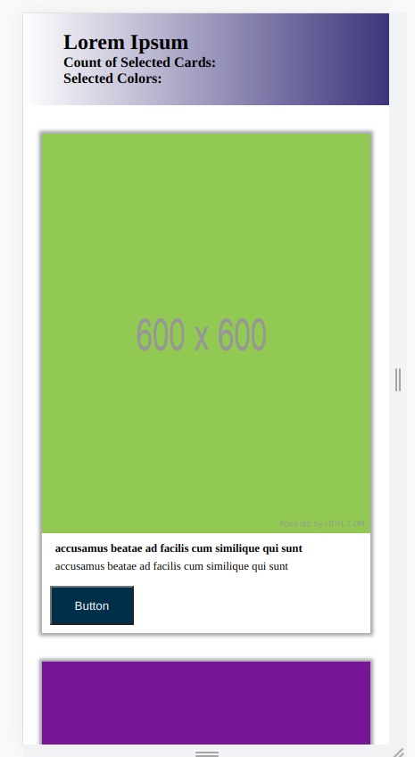
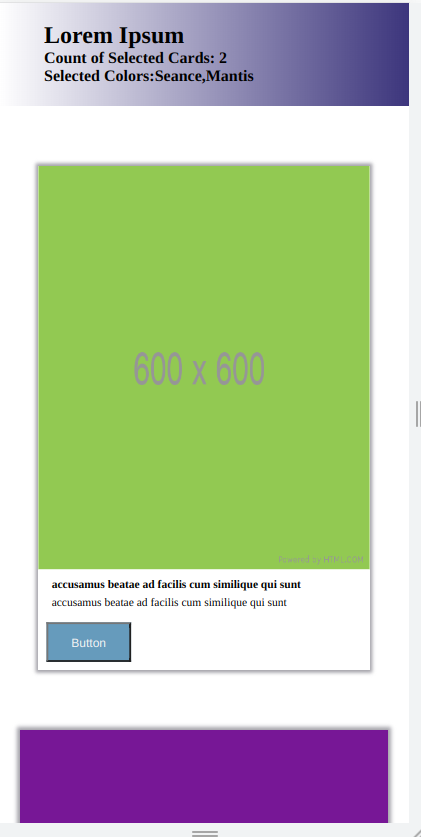
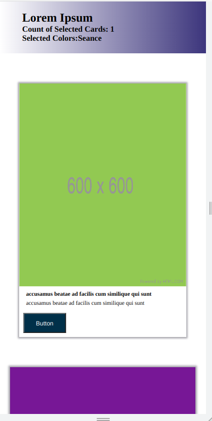

# Butey Cards Task
---
### Butey Cards Deployment

[Deployed Link](https://raghadabdulhadi1.github.io/Butey-Cards/)

---
## Web Application
Butey Cards website is all about cards that each card contains button that is used to increase the count of the selected cards, and add the color name to the selected colors that both appear at the header of the page.

---

## Tools Used
VS Code
Live Server

- css
- html
- javascript

---

## Recent Updates

#### V 1.1

---

## Getting Started

Clone this repository to your local machine.

`git clone git@github.com:RaghadAbdulhadi1/Butey-Cards.git`
`cd YourRepo/YourProject`

Run the server, either by the live server extension or directly from the menu bar.
---

## Usage

### Mobile View

### Website View

### Adding colors

### Removing a Color

---
## Data Flow (Frontend,API call)
Page design:html and css
Page Functionality: Javascript
Regarding the css, Mobile-first design approch was implemented which we started by sketching or prototyping the web app's design for the smallest screen first and gradually working up to larger screen sizes.

## Main Functionalities
- A button that when clicked once -> increses the count at the header of the page by one and adds th ecolor name to the selected colors.
- When the same button is clicked again -> decreases the count at the header of the page by one and removing the color name from the selected colors.

---

## Change Log
***[The change log will list any changes made to the code base. This includes any changes from TA/Instructor feedback]***

---

## Authors
Raghad Ayman Abdulhadi
